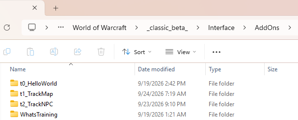
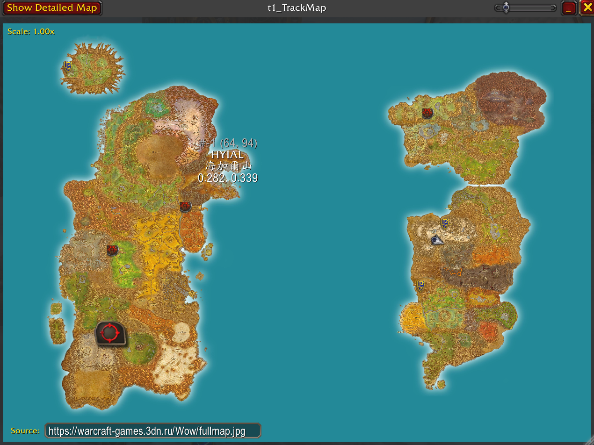
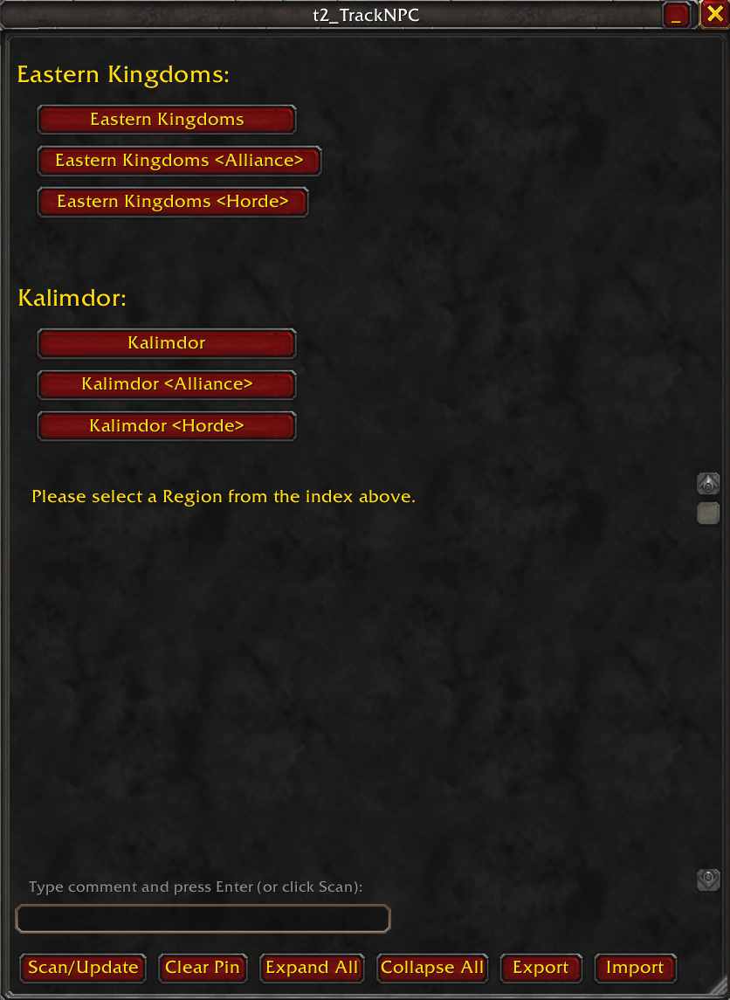

# Forever Track

A collection of independent addons for **WoW Forever**.

> 一系列為 **WoW Forever** 開發的獨立插件。

<br>

*This project is developed with significant assistance from **Google Gemini**.

> *本專案在開發過程中大量使用 **Google Gemini** 協助。

<br>


--- 
---

## Installation **安裝方式**

Download the latest released version from **[Releases](../../releases)**. A GitHub account is not required.

> 最新發布版本請從 **[Releases](../../releases)** 下載，不需要註冊或登入 GitHub。

<br>



<details>
<summary>Manual Installation / 手動安裝</summary>

Currently, the addons must be installed manually.

> 目前這些插件必須以**手動方式安裝**。

Copy the addon folders into your WoW `Interface\AddOns` directory.


> 將插件資料夾複製到 WoW 的 `Interface\AddOns` 目錄。

Example:

```text
World of Warcraft\
└── _classic_beta_\
    └── Interface\
        └── AddOns\
            ├── t0_TrackAI\
            ├── t1_TrackMap\
            ├── t2_TrackNPC\
            ├── t3_TrackQst\
            ├── t4_TrackRes\
            └── t5_TrackDgn\
            
```

Example installation path:

```text
C:\Program Files (x86)\World of Warcraft\_classic_beta_\Interface\AddOns\
```

> 實際安裝路徑可能會依你的 WoW 安裝方式而有所不同。

Each addon can be installed independently. You do not need to install all Track addons unless a feature requires another addon.

> 每個插件都可以獨立安裝。除非某項功能需要其他 Track 插件，否則不需要全部安裝。

A small **C# / WPF installer** is planned for the future. It will detect the game installation and provide automatic addon installation and updates.

> 未來預計製作一個 **C# / WPF 安裝工具**，自動偵測遊戲安裝位置，並協助安裝與更新插件。

</details>

<br>

---
---

## Usage **使用方式**


After installation, the custom addon windows can be opened with slash commands or keyboard shortcuts.

> 安裝完成後，可以使用聊天指令或鍵盤快捷鍵開啟各插件的自訂視窗。

| Addon    | Slash Command | Keyboard Shortcut |
| -------- | ------------- | ----------------- |
| TrackAI | `/t0`         | `Ctrl + Numpad 0` |
| TrackMap | `/t1`         | `Ctrl + Numpad 1` |
| TrackNPC | `/t2`         | `Ctrl + Numpad 2` |
| TrackRes | `/t3`         | `Ctrl + Numpad 3` |

<br>

---
---

## Addons **插件內容**


<details>
<summary>t0_TrackAI</summary>

### TrackAI

**Status: Planned**

`t0_TrackAI` is planned as an MCP-based AI assistant for **WoW Forever**.

> `t0_TrackAI` 預計製作成基於 MCP 的 **WoW Forever AI 助手**。

The goal is to help players track:

* Missions and quests
* Character progression
* Conversations
* Other game-related information

> 預計協助玩家追蹤：
>
> * 任務與劇情
> * 角色成長與進度
> * NPC 對話
> * 其他遊戲相關資訊

It may also provide suggestions or advice based on the player's current progression.

> 也可能根據玩家目前的遊戲進度提供建議與資訊。

The addon will require the user to provide their own AI API token.

> 此插件需要使用者自行提供 AI API Token。

</details>

---


<details>

<summary>t1_TrackMap</summary>

### TrackMap

**Status: In Development**

`t1_TrackMap` is a whole-world map addon inspired by modern GIS and web mapping applications.

> `t1_TrackMap` 是一個受到現代 GIS 與 Web Map 應用程式啟發的全世界地圖插件。

Instead of separating the world into many small regional maps, the project aims to provide a continuous map that allows the player to explore and navigate the world at different scales.

> 與將世界分割成許多區域地圖的方式不同，本專案希望提供一個連續的世界地圖，讓玩家可以在不同縮放層級中探索與瀏覽世界。

Planned features include:

* Multiple map styles
* World and regional navigation
* NPC and resource integration
* Data synchronization with other Track addons

> 預計功能包括：
>
> * 多種地圖樣式
> * 世界與區域導航
> * NPC 與資源資料整合
> * 與其他 Track 插件同步資料

</details>

---


<details>
<summary>t2_TrackNPC</summary>

### TrackNPC

**Status: In Development**

`t2_TrackNPC` is a list-based NPC database compiled from publicly available community and website resources.

> `t2_TrackNPC` 是一個以列表方式呈現的 NPC 資料庫，資料整理自公開的社群與網站資源。

The database includes NPC information such as:

* NPC name
* NPC ID
* NPC category / job
* Location
* Region
* Position data when available

> 資料庫包含例如：
>
> * NPC 名稱
> * NPC ID
> * NPC 類別／職業
> * 所在地
> * 區域
> * 可取得時的座標資料

The database can interact with the built-in map, with future plans to synchronize NPC data with `t1_TrackMap`.

> NPC 資料可以與內建地圖互動，未來預計與 `t1_TrackMap` 進一步同步。

</details>

---

<details>
<summary>t3_TrackQst</summary>

### TrackRes

**Status: Planned**

`t3_TrackQst` is planned as a resource database similar to `t2_TrackNPC`.

> `t3_TrackQst` 預計製作成類似 `t2_TrackNPC` 的資源資料庫。

It will focus on gathering resources such as:

* Herbs
* Mining veins
* Other gathering resources

> 預計收錄：
>
> * 草藥
> * 礦脈
> * 其他採集資源

The long-term goal is to integrate resource information with `t1_TrackMap`.

> 長期目標是將資源資訊整合至 `t1_TrackMap`。

</details>

<br>

---
---

## Addon Architecture **插件架構**


The addons are designed to work independently while remaining interoperable.

> 這些插件設計上可以獨立運作，同時保留彼此整合的能力。

```text
t2_TrackNPC ──────┐
                  │
t3_TrackQst ──────┼──> t1_TrackMap
                  │
t0_TrackAI ──────┘
```

For example, NPC and resource data can eventually be displayed and explored through `t1_TrackMap`, while `t0_TrackAI` may use information from the other addons to provide context-aware assistance.

> 例如，NPC 與資源資料未來可以透過 `t1_TrackMap` 顯示與瀏覽，而 `t0_TrackAI` 則可能使用其他插件提供的資料來提供更有上下文的協助。

<br>


---
---

## Development Notes **開發說明**

AI assistance has been used for:

* Code generation
* Debugging
* Research
* Refactoring
* Documentation
* Exploring implementation approaches

> AI 協助的範圍包括：
>
> * 程式碼生成
> * Debug 與問題排查
> * 資料研究
> * 程式碼重構
> * 文件撰寫
> * 實作方式探索

However, the project is still manually developed, tested, reviewed, and modified by the author.

> 不過，本專案仍由作者自行進行開發、測試、檢查與修改。

<br>

---
---

## Release Notes **版本紀錄**


<details>
<summary>0.0.1</summary>

### 0.0.1

* Repository created
* `t1_TrackMap` is working but still requires testing and tuning
* `t2_TrackNPC` is working but still requires testing and tuning
* `t0_TrackAI` planned
* `t3_TrackQst` planned

> - 建立 Repository
> - `t1_TrackMap` 已可運作，但仍需要測試與調整
> - `t2_TrackNPC` 已可運作，但仍需要測試與調整
> - `t0_TrackAI` 規劃中
> - `t3_TrackQst` 規劃中

</details>

<br>

---
---

## Usage and Sharing **使用與分享**


You are free to fork, modify, publish, and share this project and its modifications where permitted.

> 在符合相關授權與使用條件的情況下，你可以 Fork、修改、發布及分享本專案與其修改版本。

When redistributing the project or its components, please preserve the original authors and sources for:

* Source code
* Textures and images
* Game-related content and documentation
* URLs and external resources
* Databases and collected data
* Third-party libraries and assets

> 當重新發布本專案或其中的元件時，請保留原作者與來源資訊，包括：
>
> * 原始程式碼
> * 紋理與圖片
> * 遊戲相關內容與文件
> * URL 與外部資源
> * 資料庫與整理資料
> * 第三方函式庫與素材

<br>

---
---

## Copyright and Sources **版權與資料來源**


Some materials in this project are collected or compiled from public community resources and websites.

> 本專案部分內容來自公開的社群資源與網站，並經由整理或彙編後使用。

The project does not claim ownership of third-party materials. Materials are intended to be used according to their respective usage, copyright, and redistribution terms.

> 本專案不主張擁有第三方素材的所有權。相關內容應依各自的使用、著作權與再發布條款使用。

If you are a rights holder and believe that material in this project should be removed, corrected, or attributed differently, please open an issue or contact the author.

> 如果你是相關權利人，認為本專案中的內容需要移除、修正或調整來源標示，請開啟 Issue 或聯絡作者。

If you know of useful sources, databases, or resources that could improve the project, contributions and references are welcome.

> 如果你知道其他有助於改善本專案的資料來源、資料庫或相關資源，也歡迎提供資訊。

<br>


---
---

## Project Status **專案狀態**


This project is currently under active development.

> 本專案目前仍在持續開發中。

Features, data, interfaces, and internal structures may change without notice.

> 功能、資料、介面與內部結構可能會隨開發進度變更。

The project is currently intended primarily for experimentation, development, and personal/community use rather than as a finished product.

> 目前本專案主要以實驗、開發及個人／社群使用為目的，尚不是完整的正式產品。

<br>


---
---

## Resources **資源連結**


The following external resources were used as references or development resources for this project.

> 以下外部資源曾作為本專案的參考資料或開發資源。

* **Blank Azeroth Map Texture**
  https://warcraft-games.3dn.ru/Wow/fullmap.jpg


* **Detailed Azeroth Map Texture**
  http://redd.it/bid2ue


* **NPC and Resource Data**
  https://www.wowhead.com/forever/npcs


<br>


---
---

## License **授權**


See the repository files and individual third-party sources for the applicable licenses and usage terms.

> 詳細授權與使用條件請參考 Repository 中的相關文件，以及各第三方來源所提供的授權條款。

